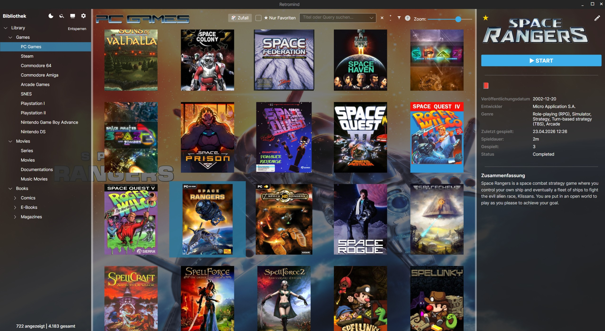
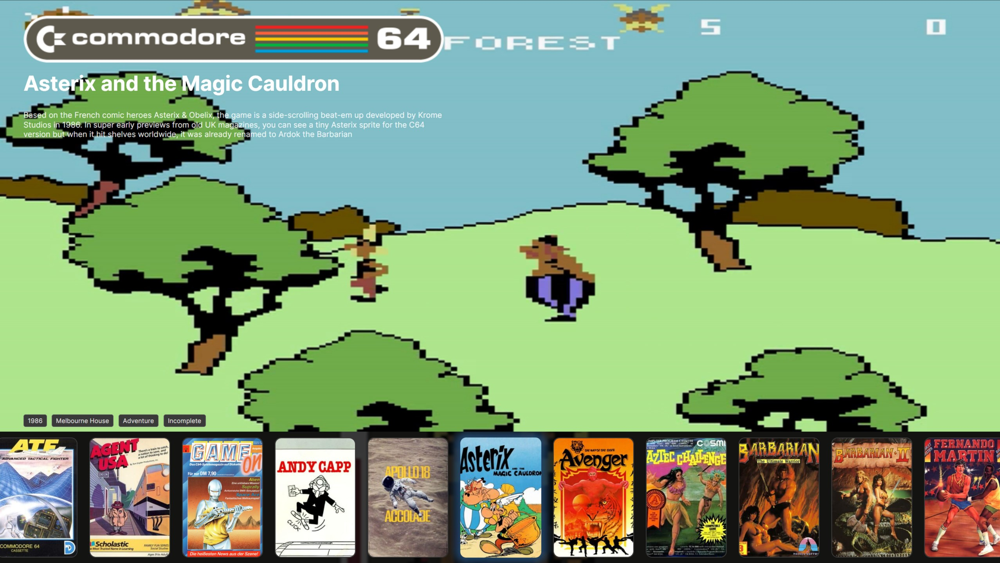
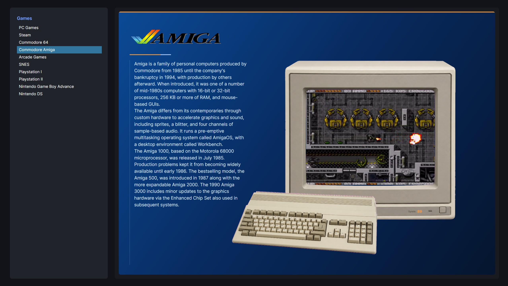
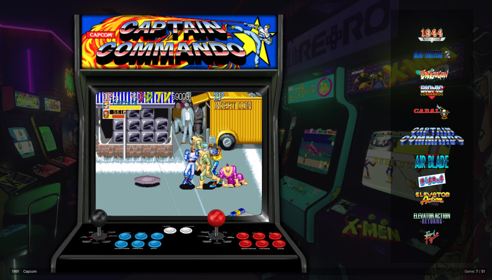

# Retromind

Built by human creativity, powered by artificial intelligence.
Dedicated to the digital spark that helped compile this reality.

 
Retromind is a Linux-first, portable media manager for organizing and launching your media library
(games, movies, books, comics, ...).

Built with **C#** + **Avalonia**.

## Website

Project homepage (GitHub Pages):

- <https://dark574.github.io/Retromind/>

## Status
IMPORTANT:

Retromind is early alpha. Data formats (retromind_tree.json, app_settings.json) can change between releases without a migration path. Therefore, use this version more for testing than for a large, long-term library.

Retromind is primarily developed and tested on CachyOS. The AppImage is built
on Debian 12 and requires glibc 2.36 or newer. Other Linux distributions are
expected to work, but have not all been tested yet. Reports and contributions
from users of other distributions are welcome.

Work in progress. Expect breaking changes while features and data formats evolve.
See `docs/CHANGELOG.md` for version history.

## Key features

- **Portable media library** with relative paths, designed to move between Linux systems on an external drive
- **Desktop and controller-friendly BigMode interfaces** with video previews and customizable runtime themes
- **Flexible game launching** for native applications, scripts and emulators, including Wine, Proton, UMU, wrappers and environment overrides
- **Metadata and artwork scraping** from multiple providers with bulk processing, per-field import decisions and additive artwork handling
- **Library discovery and filtering** through global search, favorites, saved filters and an optional metadata query language
- **Smart local imports** with multi-disc recognition and optional playlist launching
- **Store integration** for Steam and Heroic imports plus experimental native GOG library, installation, update and uninstall support
- **Managed compatibility runners**, including direct GE-Proton downloads and reusable emulator profiles

## Screenshots

> Note: The screenshots are for demonstration purposes only.  
> All product names, logos, and brands shown are property of their respective owners.

### Desktop library



- Library tree on the left (areas / categories)
- Cover grid in the center
- Details panel on the right

### BigMode (controller-friendly UI)

- Large, readable layout for couch / TV usage
- Gamepad input support
- Design and add your own themes through AXAML files

#### HorizontalRow theme with C64 media



#### Amiga system theme



#### Arcade theme



## Requirements

### AppImage

- Linux x86_64 with glibc 2.36 or newer
- X11/XWayland desktop session by default; native Wayland is available as an experimental opt-in

The AppImage is self-contained: a system-wide .NET runtime and LibVLC installation are not required.

### Source builds

- .NET SDK 10.0
- LibVLC runtime

## Build AppImage (portable release, includes VLC)
This project ships a build script that creates a portable **AppImage** containing:
- a self-contained .NET build (no system .NET required)
- bundled **LibVLC + plugins** (video playback required)
- helper/runtime libraries exported from a Debian 12 (bookworm) build container
- a checksum-pinned, statically linked AppImage runtime
- embedded GitHub Releases update information and matching `.zsync` metadata for delta updates

Note: When using the AppImage, you do not need a system-wide VLC installation because LibVLC is bundled.
The Wayland/X11 note below still applies because it affects how video is embedded into the Avalonia window.

### Build requirements (host)
- Docker (for the full reproducible bookworm build pipeline)
- `curl` (to download `appimagetool` if missing)
- `sha256sum` (normally provided by GNU coreutils)

The generated AppImage does not depend on the host `libfuse2` userspace library. Normal execution still
requires Linux kernel FUSE support; AppImage's extract-and-run fallback remains available on systems where
mounting through FUSE is unavailable.

### Build
```
chmod +x build/AppRun build/build-appimage.sh 
./build/build-appimage.sh
```

The version is read from `InformationalVersion` in `Retromind.csproj`. The build creates two release assets:

- `dist/Retromind-<version>-linux-x86_64.AppImage`
- `dist/Retromind-<version>-linux-x86_64.AppImage.zsync`

## Build & Run
### Rider

Open `Retromind.sln` and run the default configuration.

### CLI
```bash
dotnet restore
dotnet run --project Retromind.csproj
```

Start directly in BigMode:
```bash
dotnet run --project Retromind.csproj -- --bigmode
```

Or (if you run the built app directly):
```bash
./Retromind --bigmode
```

## Tests

The automated test suite is intentionally small and risk-focused. It protects the GOG install/uninstall
directory boundary, Retromind's portable path contract, prefix-path handling, and category-scoped metadata
suggestions. The tests use isolated temporary directories under `/tmp` and include Linux symbolic-link,
case-sensitivity, path-containment, migration, and library-relocation cases.

Run the complete solution test suite:

```bash
dotnet test Retromind.sln
```

The test project lives in `tests/Retromind.Tests/`. New tests should preferably target deterministic
business rules, persistence behavior, path safety, multi-disc recognition, and scraper matching rather
than Avalonia view details.

## Getting started (first run)

1. Download the latest AppImage from the [GitHub Releases page](https://github.com/Dark574/Retromind/releases) and make it executable.
2. Start the AppImage. Retromind creates `app_settings.json` in the directory containing the AppImage.
3. Configure optional metadata providers and API credentials in the settings dialog.

Developers running from source can use the commands under “Build & Run”. In that case, the portable data
root is the application output directory. To preconfigure a source build, copy `app_settings.sample.json`
there as `app_settings.json` and adjust it before starting Retromind.

## Configuration (portable)
Retromind stores data under its portable data root for portability:
- AppImage: directory of the AppImage file (ENV: `APPIMAGE`)
- Otherwise: app base directory (build output folder)

Make sure the folder is writable.

Ignored runtime files (not committed):
- `Library/`
- `app_settings.json`
- `retromind_tree.json` (+ `.bak` / `.tmp`)

A sample settings file is provided:
- `app_settings.sample.json`

### LibVLC hardware decoding (BigMode previews)

Retromind uses **LibVLC** for video previews in BigMode.  
The hardware decoding mode is configurable via `app_settings.json`:

```jsonc
"VlcHardwareDecodeMode": "none" // or "auto", "vaapi"
```

Supported values (depend on the host system / VLC build):

- `"none"`  
  Always use software decoding.  
  Safest default for unknown systems and portable AppImage builds.

- `"auto"`  
  Let VLC/FFmpeg pick a suitable hardware backend if available.  
  Good compromise on well-configured desktop systems.

- `"vaapi"`  
  Force VAAPI hardware decoding on compatible Linux systems (Intel/AMD iGPU).  
  Can noticeably reduce CPU usage and make high-resolution videos smoother,
  but may fail on systems with broken/incomplete VAAPI setups.

If the value is missing or invalid, Retromind falls back to `"none"`.

For the **AppImage**, `"none"` is recommended as default for maximum compatibility.  
On your own machine you can set `"vaapi"` in `app_settings.json` if VAAPI works
well (e.g. smoother BigMode videos, lower CPU load).

### AppImage portable HOME/XDG mode

Retromind can optionally redirect `HOME` and the `XDG_*` paths into a local
`Home/` folder next to the AppImage.

Important behavior:
- This setting affects the **Retromind AppImage process** itself.
- External launches (native apps, emulators, scripts, Steam/UMU/Proton wrappers) default to **host HOME/XDG** for compatibility.
- If you want portable child-process storage, set emulator/item overrides (`XDG_*`, optional `HOME`) explicitly.
- Portable mode is therefore **two-step**:
  1) Retromind itself is portable via `UsePortableHomeInAppImage`
  2) each launched tool/app is portable via emulator/item `XDG_*`/`HOME` overrides

The recommended way to enable this mode is **Settings -> Misc -> Use portable HOME/XDG for AppImage**.
After confirmation, Retromind enables forced mode so existing host values are redirected as well.

For equivalent manual configuration in `app_settings.json`, set both values:

```json
"UsePortableHomeInAppImage": true,
"ForcePortableHomeInAppImage": true
```

Notes:
- Only applies when running as **AppImage**.
- Requires a **restart** to take effect.
- With `ForcePortableHomeInAppImage` set to `false`, only environment variables that are currently unset are redirected.
- New emulator profiles default to **Host** XDG context for compatibility.
- In emulator settings, you can use presets to quickly set portable `XDG_*` (and optional `HOME`) per profile.

Switching back to normal mode:
- Set `"UsePortableHomeInAppImage": false` and restart Retromind.
- Retromind and external launches will use the host defaults again (unless you set explicit per-emulator/per-item overrides).
- Existing files under `Retromind/Home/` are kept as-is; they are not deleted automatically.

### Portable layout on USB sticks / external drives

Retromind is designed to work well from a single portable folder (e.g. on a USB stick)
together with your ROMs and native games. The core idea:

- The directory that contains the Retromind binary/AppImage is treated as the **portable data root**.
- Any files *inside* this directory (or subdirectories) are stored as **relative paths** in the library.
- On another Linux system, as long as you copy/mount the entire directory tree, Retromind will
  resolve these relative paths correctly, regardless of the exact mountpoint or user name.

To enable relative launch paths, turn on **Prefer portable launch paths** in settings.
This will:
- store new imports under the data root as `LibraryRelative` paths
- migrate existing item launch paths during library saves
- normalize emulator settings paths (emulator executable, `XDG_*`, and known path-like env vars such as `HOME`/`DOTNET_CLI_HOME`/`PROTONPATH`) to data-root-relative values when possible

You can also trigger a one-time migration from the settings dialog.

A practical layout might look like this:

```text
Retromind/
├── Retromind-<version>-linux-x86_64.AppImage
├── Library/
│   └── Prefixes/
├── ROMs/
│   ├── SNES/
│   └── PSX/
├── NativeGames/
└── Themes/
```

If you add ROMs or native games from anywhere *inside* the `Retromind/` folder:

- Retromind will detect that their absolute paths are under the portable root,
- convert them once to **library-relative** paths in the JSON database,
- and resolve them at runtime against the current AppImage directory.

This means:

- Moving the entire `Retromind/` folder to another machine or mounting it under a different path
  will **not** break those entries.
- Only data stored outside of `Retromind/` (e.g. `/home/user/Downloads/…`) is saved as an absolute path
  and depends on the original mountpoint.

### Wine prefixes and portability

When launching items that use Wine/Proton/UMU, Retromind can automatically create and
remember a **per-item Wine prefix** in the library:

- Prefixes are stored under `Library/Prefixes/…` (inside the portable root).
- The stored prefix path is **relative** to the library root.
- On another system, as long as the whole `Retromind/` folder moves together,
  the same prefixes will be reused.

Note:

- The prefix itself is portable within Retromind’s folder.
- Game saves/configs remain host-user specific by default.
- If needed, you can override `XDG_*` (and optionally `HOME`) per emulator/item.
- Even with overrides, full portability is launcher-dependent; some tools still rely on host state.

### Wine/Proton runner version management

Retromind supports managed Wine/Proton runtime versions and lets you select them on:

- emulator level (default for all items using that emulator)
- item level (optional override)

#### 1) Configure available runner versions

In **Settings -> Runner** you can:

- add external Wine/Proton directories manually
- download/install GE-Proton releases (stored under `Emulators/ProtonVersions` in the portable root)
- remove versions (with replacement selection when still in use)

GE-Proton source:

- Repository: https://github.com/GloriousEggroll/proton-ge-custom
- Releases API used by Retromind: https://api.github.com/repos/GloriousEggroll/proton-ge-custom/releases

Retromind does not claim ownership of GE-Proton. Names, trademarks, and licenses remain with their respective owners.
Thanks to GloriousEggroll and all contributors for maintaining and publishing GE-Proton.

#### 2) Set emulator default runner

In **Settings -> Emulators -> Advanced**:

- enable **Use per-game prefix (WINEPREFIX)** for the emulator profile
- set **Runner type** (`Auto`, `UmuProton`, `Wine`, `Generic`)
- choose **Default runner version**

Notes:

- If **Use per-game prefix (WINEPREFIX)** is disabled, emulator-level default runner selection is disabled.
- `Auto` keeps compatibility heuristics; explicit types (`UmuProton`/`Wine`) are recommended for fixed setups.

#### 3) Optional item-level override

In **Edit Item -> Prefix (Wine/Proton/UMU)**:

- select a per-item **Wine/Proton version** to override the emulator default
- leave it on **None** to inherit the emulator default
- the dialog shows which runner is currently inherited from the emulator

Effective priority:

1. Item runner version (if set)
2. Emulator default runner version
3. No explicit runner version (launcher/env behavior only)

### Native games on the stick

Native games that live under the `Retromind/` directory tree (e.g. `Retromind/NativeGames/MyGame/...`)
are resolved the same way as ROMs:

- Internally, Retromind stores their launch paths relative to the portable root.
- On a different Linux system, launching still works as long as:
  - the game files remain in the same relative position under `Retromind/`,
  - system-level dependencies (e.g. libraries, drivers) required by the game are available.

Game-specific saves/configs stored under the user’s home directory are not moved automatically;
they will behave like any regular native Linux game when run on a different machine.

## Launch arguments placeholders

When configuring emulator profiles or per-item launch arguments, Retromind supports a few simple placeholders that are expanded at launch time:

- `{file}`  
  Full path to the primary launch file (quoted when needed).
- `{fileDir}`  
  Directory of the primary launch file (no trailing slash).
- `{fileName}`  
  File name including extension (e.g. `cabal.zip`).
- `{fileBase}`  
  File name without extension (e.g. `cabal`).

These placeholders can be used in both:

- **Emulator profile arguments** (`EmulatorConfig.Arguments`)
- **Per-item arguments** (`MediaItem.LauncherArgs`), which are combined with the profile arguments.

### Example: Flatpak MAME via emulator profile

To launch the Flatpak MAME build using ROM short names derived from the file path:

- **Executable path**:  
  `flatpak`
- **Default arguments**:  
  `run org.mamedev.MAME {fileBase}`

With a ROM stored as:
```text
/run/media/…/MAME/NameOfROM.zip
```

Retromind expands `{fileBase}` to `NameOfROM` and starts:
```bash
flatpak run org.mamedev.MAME NameOfROM
```

Make sure the ROM directory is part of MAME’s `rompath`, or pass it explicitly:
```text
run org.mamedev.MAME -rompath "{fileDir}" {fileBase}
```

which yields, for the example above:
```bash
flatpak run org.mamedev.MAME -rompath "/run/media/…/MAME" NameOfROM 
```

### Example: Wine / UMU wrappers

For Wine-based games (e.g. via UMU) you can keep most logic in the emulator profile:
```text
umu-run --some-default-options {file} 
```

and use per-item arguments only for game-specific flags, e.g.:
```text
--use-special-mode 
```

Retromind combines profile + item arguments into a single command line while expanding the placeholders as described above.

## API keys / Secrets (Scrapers)
Retromind does **not** use any bundled default keys at runtime.  
Providers that require credentials read them from the scraper configuration in the settings dialog.
OpenLibrary does not require credentials, and the Google Books API key is optional.

Scraper secrets are not written to `app_settings.json` as plain text. Retromind stores them using portable
application-level encryption (for example, `EncryptedApiKey`). Because its encryption key ships with the
open-source application, this prevents casual disclosure but is not protection against a targeted attack.

### Scraper metadata coverage

The table below shows which metadata fields are currently populated by each provider.
`Source` is populated for all providers.

| Provider | Description | ReleaseDate | Rating | Developer | Genre | Platform | Publisher | Series | ReleaseType | SortTitle | PlayMode | MaxPlayers | CustomFields |
|---|---|---|---|---|---|---|---|---|---|---|---|---|---|
| IGDB | yes | yes | yes | yes | yes | yes | yes | yes | yes | yes | yes | - | `IGDB.Slug` |
| TheGamesDB | yes | yes | yes | yes | yes | yes | yes | - | - | - | - | yes | - |
| TMDB | yes | yes | yes | - | - | - | - | - | yes | yes | - | - | - |
| OpenLibrary | - | yes | - | - | - | - | yes | yes | yes | yes | - | - | - |
| Google Books | yes | yes | - | - | - | - | yes | - | yes | yes | - | - | - |
| ComicVine | yes | - | - | - | - | - | yes | yes | yes | yes | - | - | `IssueNumber`, `StartYear` |
| SteamGridDB | - | - | - | - | - | - | - | - | - | - | - | - | - |
Notes:
- `CustomFields` are provider-specific key/value pairs and may vary by API response quality.
- Missing values are normal when the upstream provider does not return that field for a specific item.
- SteamGridDB is an artwork-focused provider and currently supplies cover, wallpaper and logo assets.
- Providers can expose optional preview and result-enrichment capabilities. The manual dialog loads
  lightweight result previews first and requests fuller data only for the selected result; bulk scraping
  enriches only an accepted match.
- Manual scraping lets you choose individual changed metadata fields. Existing artwork is retained and
  selected new artwork is added instead of replacing it.
- EmuMovies is currently not listed here because its API is being reworked.

### Where to get API keys

You need to create your own API keys on the respective provider pages:

- **TMDB (The Movie Database)**  
  Create a free account at:  
  https://www.themoviedb.org/  
  Then go to *Settings → API* in your profile and request an API key (v3 auth).
  Enter this key in the TMDB scraper configuration in Retromind.

- **IGDB (via Twitch Developer)**
  1. Create a Twitch Developer account:  
     https://dev.twitch.tv/
  2. In the Developer Console, create an application to obtain:
    - `Client ID`
    - `Client Secret`
  3. Enter both values in the IGDB scraper configuration in Retromind.

- **TheGamesDB**
  1. Create an account at <https://thegamesdb.net/>.
  2. Log in and obtain your key from <https://api.thegamesdb.net/key.php>.
  3. Enter the key in the TheGamesDB scraper configuration in Retromind.

- **SteamGridDB**
  1. Create an account at:
     https://www.steamgriddb.com/
  2. Generate a personal API key under *Preferences → API*:
     https://www.steamgriddb.com/profile/preferences/api
  3. Enter the key in the SteamGridDB scraper configuration in Retromind.

- **ComicVine**
  1. Create a ComicVine account.
  2. Log in and obtain your key from <https://comicvine.gamespot.com/api/>.
  3. Enter the key in the ComicVine scraper configuration in Retromind.

- **Google Books (optional)**  
  The Google Books API can be used without a key in many cases, but you may
  configure an API key to raise limits:  
  https://console.cloud.google.com/apis/library/books.googleapis.com  
  Create a project, enable the Books API, and create an API key. Enter it in
  the Google Books scraper configuration in Retromind.

Each user is responsible for their own API keys and must comply with the
respective provider terms of service.

## Wayland / X11 note (VLC video embedding)
Retromind uses X11/XWayland by default. Avalonia 12.1's native Wayland backend is available as an
**experimental opt-in**:

```bash
./Retromind-<version>-linux-x86_64.AppImage --avalonia-platform=wayland
```

For source builds, pass the Retromind argument after the `dotnet run` separator:

```bash
dotnet run --project Retromind.csproj -- --avalonia-platform=wayland
```

When Wayland is requested, Retromind uses Avalonia's Wayland initialization fallback and starts with X11
if the native backend cannot be initialized. Omit the option or pass `--avalonia-platform=x11` to select
X11 explicitly. `--avalonia-platform=auto` intentionally keeps the stable X11 default; Wayland always
requires an explicit opt-in.

The Wayland backend is still classified as experimental by Avalonia. Retromind also depends on native
integration for **LibVLC video embedding** and **embedded OAuth/WebView**, so these paths need additional
real-world testing. In AppImage Wayland sessions, GOG authentication conservatively uses the system-browser
fallback instead of the embedded WebView.

Source: <https://docs.avaloniaui.net/docs/platform-specific-guides/linux#wayland>

## SortTitle
- Retromind sorts media entries by `SortTitle` attribute if it is set.
- If `SortTitle` is empty, Retromind falls back to `Title`.
- This is useful for series ordering (for example: `Series 001 - ...`, `Series 002 - ...`).

## Search (Power Query)
- Available in both search fields: global search and local node search.
- Plain text terms search title by default.
- Field terms: `key:value` or `key=value`.
- Metadata completeness terms: `has:<field>` and `missing:<field>`.
- Year comparisons: `year:>=YYYY`, `year:>YYYY`, `year:<=YYYY`, `year:<YYYY` (or exact `year:YYYY` / `year=YYYY`).
- Logical operators: `AND`, `OR`, `NOT`, and parentheses `(` `)`.
- Space between terms is treated as `AND`.
- In mixed queries, plain terms still search title (example: `zelda AND platform:switch`).
- Use quotes for values with spaces (example: `developer:"Treasure Co. Ltd."`).

Supported keys (aliases included):
- `title`, `sorttitle`, `description`/`notes`, `developer`, `publisher`, `platform`, `source`
- `genre`, `series`, `releasetype`, `playmode`, `players`/`maxplayers`
- `status`/`state`, `year`, `date`/`released`, `tag`/`tags`, `id`, `favorite`
- Custom fields:
  - `cf:<text>` searches custom field keys and values.
  - `cfk:<text>` searches only custom field keys.
  - `cfv:<text>` searches only custom field values.
  - `cf.<fieldname>:<text>` searches a specific custom field key (example: `cf.rating:5`).

Examples:
- `zelda` -> title-only search
- `platform:snes AND developer:nintendo`
- `maxplayers:2 AND status:completed`
- `year=1998 favorite=true`
- `year:>=1995 AND year:<2000`
- `missing:genre OR missing:developer`
- `has:genre AND NOT genre:unknown`
- `(genre:platformer OR genre:metroidvania) AND NOT missing:rating`
- `cf.rating:5`
- `zelda AND platform:switch`

## GOG (Experimental)

The native GOG integration is currently **experimental**.
Please test it carefully and expect rough edges or breaking behavior between alpha releases.

### Requirements

- Linux desktop session with X11/XWayland, or native Wayland through the experimental opt-in described above.
- Secret store support:
  - preferred: Secret Service (`secret-tool`, GNOME Keyring/KWallet/libsecret backend)
  - fallback: in-memory session storage (non-persistent)
- For embedded OAuth login dialogs: host `libwebkit2gtk` runtime available.
  - If embedded OAuth is unavailable, Retromind falls back to system browser login with manual callback URL input.

### Usage

- Import full GOG library into a dedicated node:
  1. Create a new node.
  2. Open node settings and mark it as a GOG node (`StoreProviderId = gog`).
  3. Run **Add GOG media** on that node.
  4. Retromind syncs owned GOG titles additively into that node.

- Add individual GOG items into any node:
  1. Run **Add GOG media** on any target node.
  2. Use the picker dialog and select only the titles you want to add.

- Install a linked title without a launch configuration by using its main **Install** action. Retromind
  downloads the selected Linux or Windows installer, supports resumable downloads, runs the installer,
  and derives a launch configuration where possible.

- Uninstall actions remove an installation only when the directory passes the path-safety policy and
  contains a matching Retromind ownership marker. Files outside the owned install directory are not
  treated as disposable application data.
- With **Prefer portable launch paths** enabled, GOG installations inside Retromind store their install root
  relative to the portable data root. Existing and deliberately external absolute install paths remain
  supported.

### Update workflow (Experimental baseline)

- Update checks are only performed for installed GOG-linked items.
- Checks are triggered automatically:
  - when selecting an installed GOG item in the UI
  - and by a background sweep (currently every 24 hours)
- If an update is detected, Retromind shows:
  - an update badge in the media details
  - an **Update** action button (same panel as install/reinstall actions)
- Running **Update** reuses the existing installer flow (download + install) and then refreshes the stored install fingerprint metadata.
- Important baseline note:
  - reliable version/signature comparison requires an install fingerprint from Retromind.
  - If a title was installed outside Retromind or before this metadata existed, run one reinstall via Retromind to establish the baseline.

## Architecture
See [`docs/architecture.md`](docs/architecture.md).
For native GOG provider status and design notes, see [`docs/gog-provider.md`](docs/gog-provider.md).

## Contributing

Contributions are welcome!  
Before opening issues or pull requests, please have a look at:

- [`CONTRIBUTING.md`](CONTRIBUTING.md) – contribution guidelines
- [`CODE_OF_CONDUCT.md`](CODE_OF_CONDUCT.md) – expected behavior in the project community

## License
GPL-3.0-only (see `COPYING`).

### Third-party trademarks

Third-party product names and trademarks are used only to identify the systems and services
that Retromind supports. They remain the property of their respective owners.

“Super Nintendo Entertainment System” and “SNES” are trademarks of Nintendo. Retromind
is an independent project and is not affiliated with, sponsored by, or endorsed by Nintendo.
