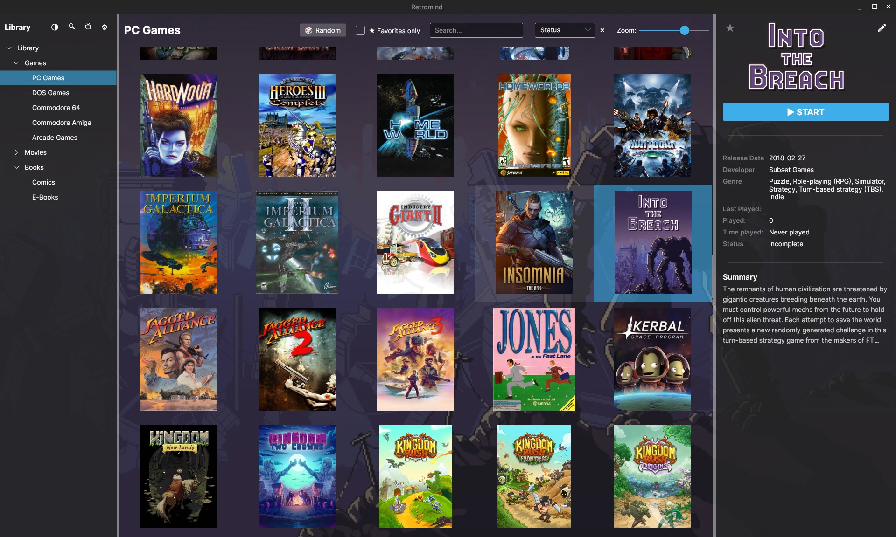
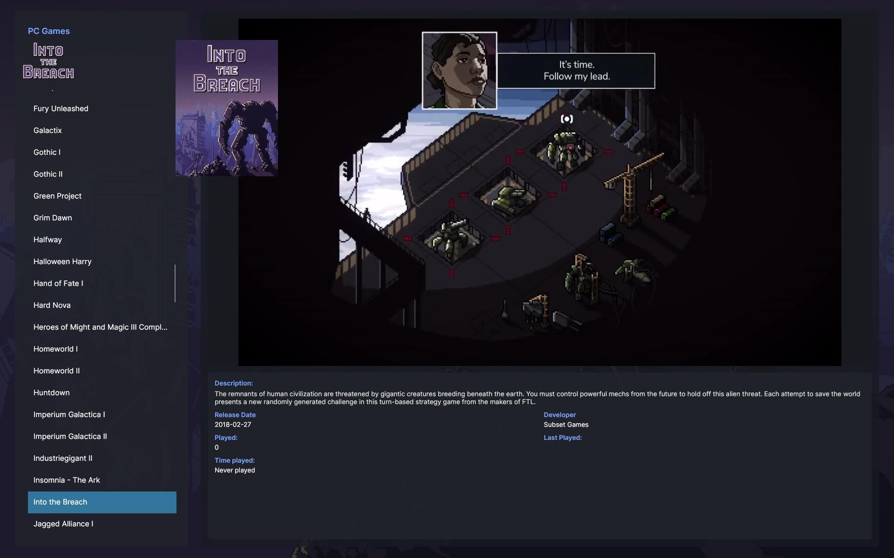
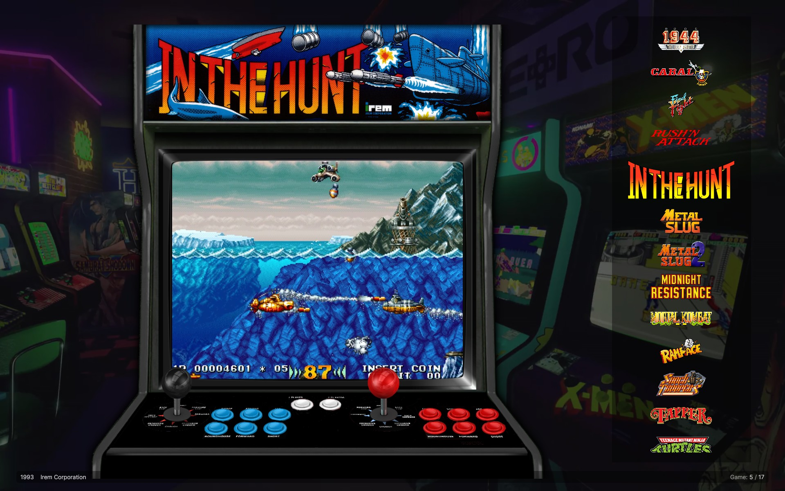

# Retromind

Retromind is a **Linux-first**, portable media and game launcher
for organizing and starting your library:

- ROM collections
- Games (e.g. GOG, Steam)
- Movies
- Books
- Comics

Built with **C#** + **Avalonia**, distributed as a portable **AppImage**.

---

## Why Retromind?

Retromind focuses on:

- **Linux-first experience**  
  Optimized for Linux desktops and portable setups (USB drives, external disks).

- **Portable layout**  
  Keeps paths relative to the app directory so you can carry your library and launcher together.

- **Large libraries**  
  Fast filtering and search, even with tens of thousands of items.

- **Open source**  
  Licensed under GPL-3.0-only and developed in the open on GitHub.

---

## Features

- Library tree (areas / categories) on the left
- Cover / grid view in the center
- Details view on the right
- Metadata scraping (TMDB, IGDB, Google Books, …)
- Optional **BigMode** – controller-friendly UI
- AppImage build script with bundled LibVLC
- Hardware decoding options for video previews (configurable)

---

## Screenshots

> Note: The screenshots are for demonstration purposes only.  
> All product names, logos, and brands shown are property of their respective owners.

### Main library view



### BigMode (controller-friendly UI)




---

## Download

The latest builds are available on GitHub Releases:

- **Releases:**  
  [https://github.com/Dark574/Retromind/releases](https://github.com/Dark574/Retromind/releases)

Look for the `Retromind-x86_64.AppImage` asset for the portable Linux build.

---

## Build from source

Requirements:

- .NET SDK 10.0
- Linux (primary target)
- Optional: VLC / LibVLC on the system (if you are not using the AppImage)

Basic usage:
```bash
dotnet restore 
dotnet run --project Retromind.csproj
```

Start directly in BigMode:
```bash
dotnet run --project Retromind.csproj -- --bigmode
```

For more details, see the README in the repository:

- https://github.com/Dark574/Retromind

---

## Contributing

Contributions are welcome!

Please read:

- [CONTRIBUTING.md](https://github.com/Dark574/Retromind/blob/main/CONTRIBUTING.md)
- [CODE_OF_CONDUCT.md](https://github.com/Dark574/Retromind/blob/main/CODE_OF_CONDUCT.md)

before opening issues or pull requests.

---

## License

Retromind is licensed under **GPL-3.0-only**.  
See the full license text here:

- [COPYING](https://github.com/Dark574/Retromind/blob/main/COPYING)